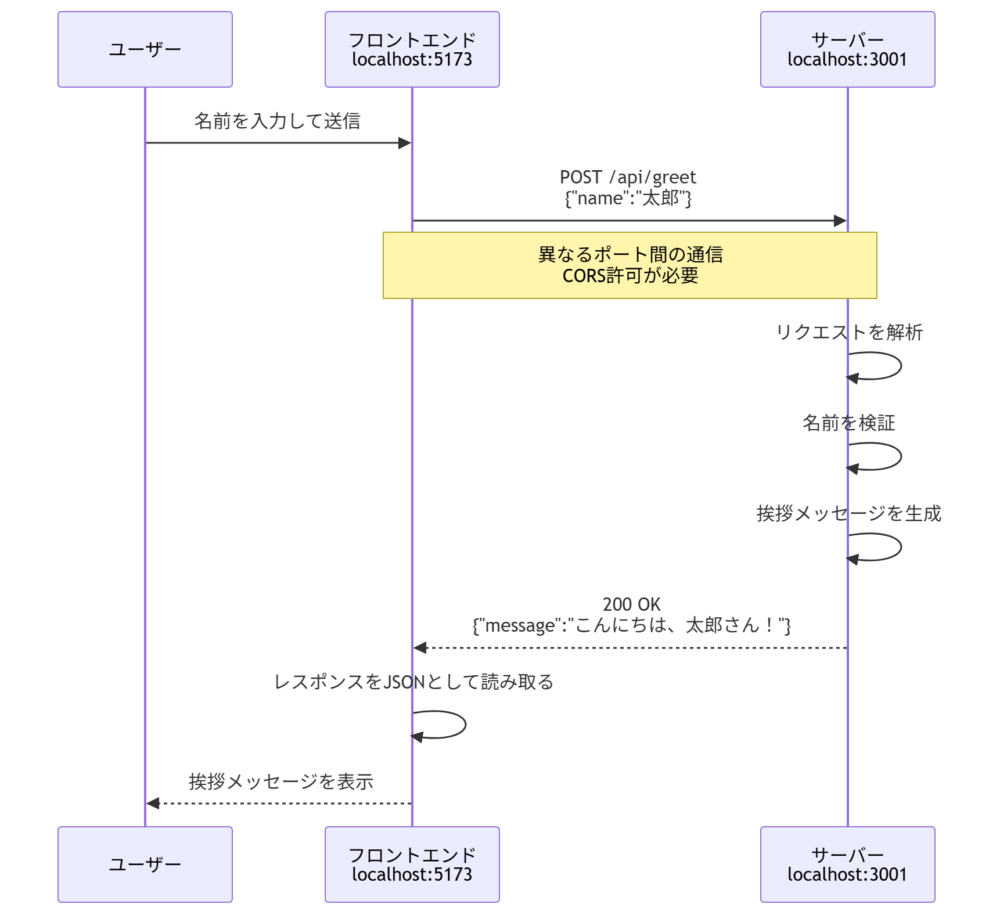

# React + Express 学習プロジェクト

名前を入力すると挨拶メッセージが返ってくるだけの、最小構成のReact + REST APIです。

## 1. 概要 

- **SPA（Single Page Application）**：最初に index.html などのHTMLを読み込み、その後はJavaScript（React）が画面の必要な部分だけを更新する。ページ全体のリロードを基本的に行わずに画面を切り替える。
- **サーバー (Express)**: `GET /api/health` で稼働状態を確認でき、`POST /api/greet` でJSONを受け取り、挨拶メッセージを返すシンプルなREST API。
    - Express: Webアプリ・REST APIを作りやすくするフレームワーク
- **クライアント⇔サーバー通信**: ブラウザの`fetch`でJSONをやり取りする。通信処理は`client/src/api/greetApi.js`に集約し、コンポーネント(`GreetForm.jsx`)は「呼び出すだけ」にすることで関心を分離している。
    - https://developer.mozilla.org/ja/docs/Web/API/Fetch_API
    - CORS(Cross-Origin Resource Sharing：オリジン間リソース共有): 異なるオリジン間でブラウザからデータをやり取りするときに、サーバー側が「このアクセス元からの通信を許可します」と指定する仕組み



## 2. セットアップと起動

```bash
# ターミナル1: サーバー
cd server
npm install
npm start        # http://localhost:3001

# ターミナル2: クライアント
cd client
npm install
npm run dev       # http://localhost:5173
```

`.env.example`を`.env`としてコピーし、APIサーバーのURLを設定します。PowerShellでは次のコマンドを実行できます。

```powershell
cp .env.example .env
```

`.env`の内容:

```env
VITE_API_BASE_URL=http://localhost:3001
```

ブラウザで`http://localhost:5173`を開き、名前を入力して送信すると挨拶が表示されます。

サーバーの稼働確認は、ブラウザで`http://localhost:3001/api/health`にアクセスしてください。


## 3. テストの実行

このプロジェクトでは、**サーバー側のみ**自動テストを用意しています。

```bash
cd server && npm test    # Jest + Supertest
```

- **Jest**: テストランナー/アサーションライブラリ(テストの実行と検証を担当)
- **Supertest**: サーバーを起動せずにHTTPリクエストをシミュレートし、Expressのエンドポイントをテストするためのライブラリ


## 4. ペアプログラミング演習: 機能を1つ追加する

`server/src/controllers/greetController.js` と `client/src/components/GreetForm.jsx` を
編集してみましょう。

- **文字数バリデーション**: 名前が10文字を超えたらサーバー側で400エラーを返す

役割 |目的
--- | --
クライアント側バリデーション|UX(使い勝手)のため。送信前にすぐフィードバックを返し、無駄な通信を減らす
サーバー側バリデーション|セキュリティ・データ整合性のため。信頼できない入力を最終的に守る唯一の砦

#### 進め方の例(TDD:テスト駆動開発):
1. まずサーバー側のテスト(`greet.test.js`)に「期待する挙動」のテストケースを追加する
2. `greetController.js`を編集してテストを通す


## 5. リファクタリング演習

-  `postGreet`関数の中に書かれているバリデーション処理を、
別の関数(`validateName`)に分離してみましょう。

**確認ポイント**:
- リファクタリング後も `npm test` が通ること(挙動が変わっていないことの確認)

## 6. CI (GitHub Actions)

`.github/workflows/ci.yml`により、`main`ブランチへのpush/PR時に以下が自動実行されます。

- `server`ディレクトリで`npm install` → `npm test`(Jest)


参考：https://docs.github.com/en/actions/get-started/quickstart
